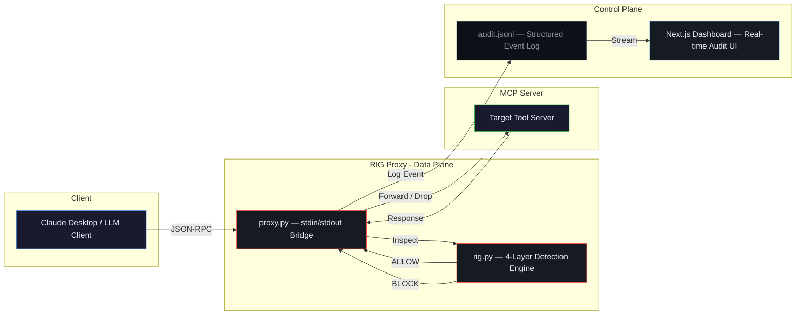

<div align="center">

# 🛡️ Runtime Integrity Guard (RIG)

**An intelligent MCP proxy that detects and blocks tool-poisoning, rug-pull, and prompt injection attacks in real-time.**

[](https://nextjs.org/)
[](https://react.dev/)
[](https://www.typescriptlang.org/)
[](https://tailwindcss.com/)
[](https://www.python.org/)
[](https://ai.google.dev/)
[](https://www.docker.com/)
[](https://opensource.org/licenses/MIT)

</div>

---

## The Problem

The **Model Context Protocol (MCP)** lets LLMs call external tools — but those tool servers can be compromised. Attackers can:
- **Tool Poisoning:** Inject hidden instructions into tool descriptions to hijack LLM behavior.
- **Rug-Pull Attacks:** Swap safe tool definitions for malicious ones mid-session.
- **Prompt Injection:** Embed `<SYSTEM>` overrides or exfiltration commands in tool responses.

**RIG sits between the LLM client and the MCP server**, inspecting every JSON-RPC message in real-time to catch these attacks before they reach the model.

---

## Architecture



### Detection Pipeline (Defense in Depth)

| Layer | Name | Technique | Latency |
|:---:|---|---|:---:|
| **L1** | Baseline Integrity | SHA-256 hash comparison of tool schemas against a known-good snapshot | < 1ms |
| **L2** | Context Window Guard | Drops payloads exceeding safe token limits (>50k chars) to prevent context flooding | < 1ms |
| **L3** | Pattern Matching | Regex-based detection of known attack signatures (`<SYSTEM>`, `[PROMPT OVERRIDE]`, credential exfil patterns) | < 5ms |
| **L4** | LLM Semantic Judge | Sends suspicious payloads to Gemini 2.5 Flash for deep semantic analysis of intent | ~500ms |

---

## Directory Structure

```
├── proxy.py               # Data Plane: Multi-threaded stdin/stdout MCP proxy
├── rig.py                 # Core: 4-layer detection engine (L1-L4)
├── pre_cache.py           # Utility: Generates baseline hashes for tool schemas
├── requirements.txt       # Python dependencies
│
├── src/                   # Control Plane: Next.js Dashboard (App Router)
│   └── app/
│       ├── page.tsx       # Main dashboard UI (React + Tailwind)
│       ├── layout.tsx     # Root layout with metadata
│       ├── globals.css    # Design system tokens
│       └── api/logs/
│           └── route.ts   # Server API route (reads audit.jsonl)
│
├── tests/                 # Test infrastructure
│   ├── echo_server.py     # Benign MCP server for baseline testing
│   ├── malicious_server.py# Hostile MCP server with injection payloads
│   ├── test_rig_direct.py # Direct engine unit tests
│   └── run_all_tests.py   # Full E2E test harness
│
├── Dockerfile             # Multi-stage production container
├── docker-compose.yml     # One-command deployment
├── package.json           # Node.js dependencies
├── next.config.ts         # Next.js configuration (standalone output)
└── tsconfig.json          # TypeScript configuration
```

---

## Quick Start

### Prerequisites
- **Python 3.11+** with pip
- **Node.js 20+** with npm
- **Gemini API Key** (optional, for L4 LLM Judge)

### 1. Install Dependencies

```bash
# Python proxy engine
pip install -r requirements.txt

# Next.js dashboard
npm install
```

### 2. Generate Security Baseline

```bash
python pre_cache.py python tests/echo_server.py
```

### 3. Launch the Command Center

```bash
npm run dev
```

Open **http://localhost:3000** to access the real-time security dashboard.

### 4. Attach RIG to Claude Desktop

Edit your `claude_desktop_config.json`:

```json
{
  "mcpServers": {
    "protected-server": {
      "command": "python",
      "args": [
        "C:/path/to/proxy.py",
        "python",
        "C:/path/to/tests/echo_server.py"
      ]
    }
  }
}
```

### 5. Run Attack Simulations

```bash
cd tests
python run_all_tests.py
```

---

## Docker Deployment

```bash
docker-compose up -d --build
```

---

## Environment Variables

| Variable | Default | Description |
|---|---|---|
| `GEMINI_API_KEY` | — | API key for Gemini 2.5 Flash (enables L4 LLM Judge) |
| `RIG_LAYER4_SAMPLE_RATE` | `1.0` | Fraction of requests sent to L4 (0.0–1.0) |
| `RIG_LAYER4_CONFIDENCE_THRESHOLD` | `70.0` | Minimum confidence score to trigger a BLOCK verdict |
| `AUDIT_LOG_PATH` | `./audit.jsonl` | Override path for the structured audit log |

---

## Tech Stack

| Layer | Technology | Purpose |
|---|---|---|
| **Proxy Engine** | Python 3.11+, `subprocess`, `threading` | Multi-threaded stdin/stdout MCP bridge |
| **Detection Engine** | SHA-256, Regex, Google Gemini 2.5 Flash | 4-layer defense-in-depth pipeline |
| **Dashboard** | Next.js 16, React 19, TypeScript 5 | Real-time security monitoring UI |
| **Styling** | Tailwind CSS 4, Lucide Icons | GitHub Dark Mode-inspired design system |
| **Containerization** | Docker, Docker Compose | Production deployment |
| **Protocol** | JSON-RPC 2.0 (MCP Specification) | LLM ↔ Tool communication standard |
